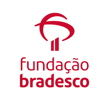

## Orientação a Objetos em Python

Este foi o meu primeiro contato com orientação a objetos, foi fundamental para mim como desenvolvedor aprender esses conceitos com a instituição, <a href="https://www.ev.org.br/">Fundação Bradesco</a>

### Linguagem usada:

### IDE

## Autor

<a href="https://www.linkedin.com/in/felype-dantas-dos-santos-94497b193?utm_source=share&utm_campaign=share_via&utm_content=profile&utm_medium=android_app">

  
 <b>Felype Dantas Dos Santos</b></a> 

Feito por Felype Dantas Dos Santos 👨🏻‍💻 Entre em contato!

